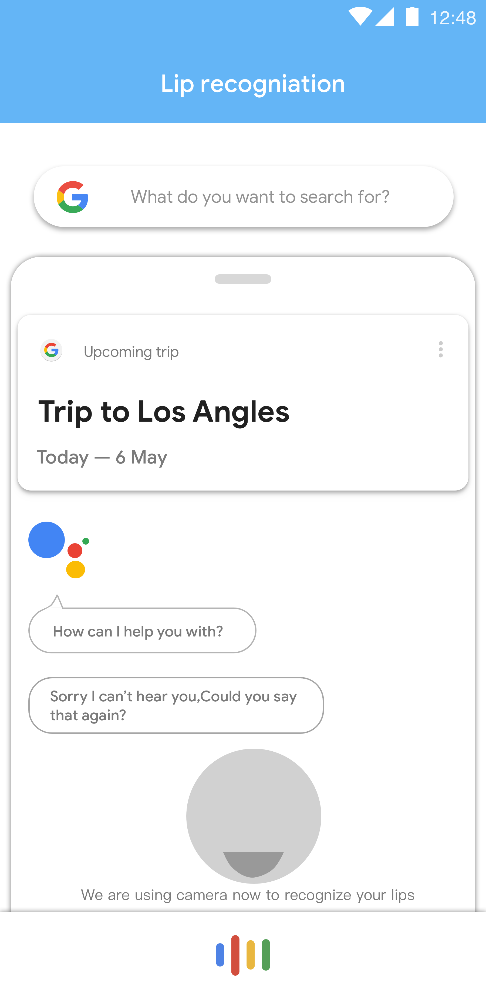
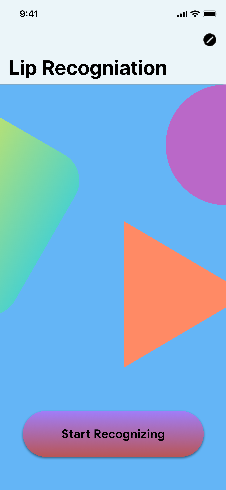
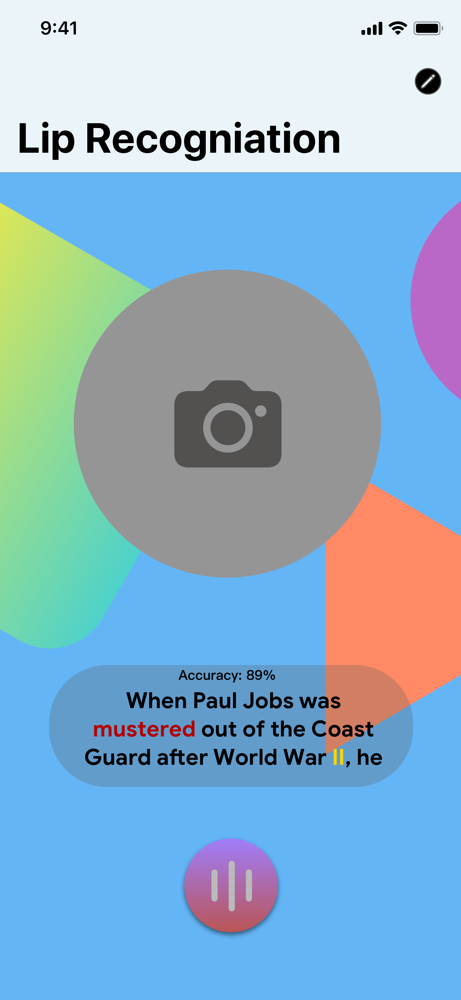

# AndroidDevChallenge 
# The idea is to let voice assistant can read lips language at a noise environment.
### What is this project?
This project is to read your lips language with your phone camera when your environment is noisy. Due to the noisy environment, the microphone picks up too many invalid sounds. At this time we can use your mobile phone camera to read your lips language more efficiently. We hope that it can be used by Google Assistant to improve recognition efficiency, while also helping deaf people.
### Implement deadlines 
⚪11/7 Accomplish UI design -Ongoing

⚪11/25 Complete model training 

⚪11/27 Complete Test on both iOS and android device 
### Use scene on Google Assistant

### Alpha Design

 
